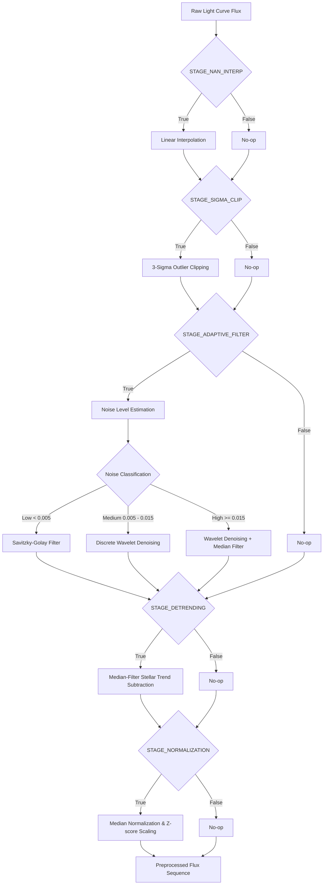
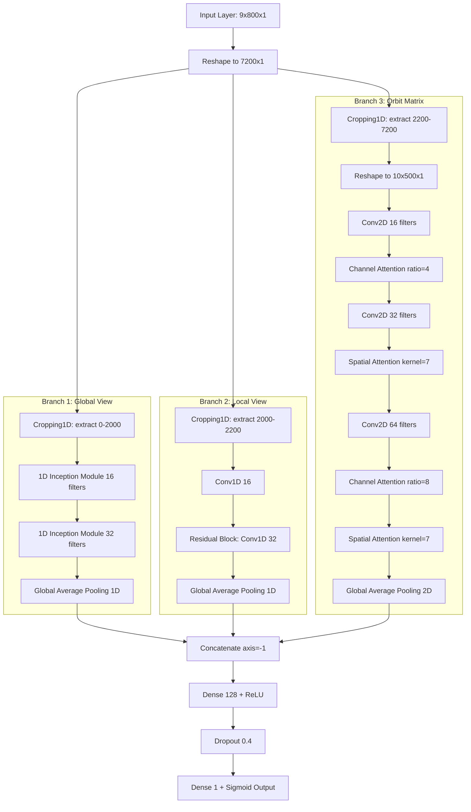

# STELSION ramanuj_model Architecture & Preprocessing Reference

This document details the data preprocessing pipeline, feature engineering/folding view generation, and model architectures implemented in the `ramanuj_model` (STELSION Research Model V2).

---

## 1. Preprocessing Pipeline (`preprocessing.py` & `filters.py`)

The model features a highly modular, stage-by-stage adaptive preprocessing pipeline configured in [config.py](file:///c:/Users/Debomoy%20Patra/Desktop/New%20folder/ramanuj_model/config.py) and executed via [preprocessing.py](file:///c:/Users/Debomoy%20Patra/Desktop/New%20folder/ramanuj_model/preprocessing.py). Each stage is independently toggleable:

### Preprocessing Stages Detailed

1. **NaN Interpolation** (`STAGE_NAN_INTERP`):
   Identifies all missing `NaN` values and fills them using 1D linear interpolation (`np.interp`) against valid neighboring timestamps.

2. **Outlier Clipping** (`STAGE_SIGMA_CLIP`):
   Performs iterative 3-sigma clipping (2 iterations by default) to replace extreme spikes or outliers with the running mean, preventing anomalously deep points from corrupting model signals.

3. **Noise Estimation & Adaptive Filtering** (`STAGE_ADAPTIVE_FILTER` & `STAGE_NOISE_EST`):
   Estimates the noise level $\sigma$ of the light curve using the standard deviation of first-order differences divided by $\sqrt{2}$. Based on the noise level, it adaptively routes the flux to one of three smoothing methods:
   - **Low Noise (< 0.005)**: Applies a **Savitzky-Golay filter** (`window_size=15`, `polyorder=2`) to preserve fine-grained transit shapes.
   - **Medium Noise (0.005 to 0.015)**: Applies **Discrete Wavelet Denoising** (`wavelet='db4'`, `level=2`) using soft thresholding to isolate and suppress high-frequency components.
   - **High Noise (>= 0.015)**: Combines **Wavelet Denoising** with a **Median Filter** (`kernel_size=5`) to suppress aggressive, non-Gaussian noise.

4. **Stellar Trend Removal / Detrending** (`STAGE_DETRENDING`):
   Subtracts a heavily median-filtered version of the light curve (`window_size=101`) from the flux. This eliminates slow-moving stellar rotation trends, instrument drifts, and flares, leaving only flat, transit-friendly data.

5. **Median Normalization & Z-Score Scaling** (`STAGE_NORMALIZATION`):
   - First centers the flux around 0: `flux = flux / np.median(flux) - 1.0`.
   - Then standardizes it by dividing by the standard deviation: `flux = flux / np.std(flux)`. This keeps input features within a uniform scale.

---

## 2. Data Folding & Multi-View Feature Engineering (`dataset.py`)

To feed sequential time-series data into convolutional networks, `ramanuj_model` translates 1D light curves into a structured **multi-view dataset** that isolates different transit timescales.

1. **Box Least Squares (BLS) Periodogram Search**:
   If catalog parameters are missing, a BLS search runs to estimate the planet candidate's orbital period ($P$), epoch ($T_0$), transit duration ($d$), and transit depth.

2. **Multi-View Extraction**:
   Using the orbital parameters, the preprocessed light curve is phase-folded ($phase = \frac{t - T_0}{P} + 0.5 \pmod 1$) and decomposed into three independent views:
   - **Global View**: The entire folded orbit interpolated/binned to **2000 points**. Captures the full out-of-transit baseline and secondary eclipses.
   - **Local View**: A zoomed-in window of $4 \times d$ centered on the transit region (phase 0.5), binned to **200 points**. Captures fine details of the transit ingress, egress, and bottom shape.
   - **Orbit Matrix**: Divides the light curve chronologically by orbit cycle. Individual orbits are binned to **500 points** each. A total of **10 orbits** are stacked to construct a $10 \times 500$ matrix. This view helps distinguish authentic periodic transits from sporadic single-event noise.

3. **Unified Input Packaging**:
   The views are flattened and concatenated:
   $$\text{Length} = 2000 \, (\text{Global}) + 200 \, (\text{Local}) + 5000 \, (\text{Orbit Matrix}) = 7200$$
   This 1D array is reshaped to **`(9, 800, 1)`** so it can be ingested as a single input compatible with standard deep learning pipelines.

---

## 3. Neural Network Architectures (`architectures/`)

`ramanuj_model` implements four model architectures. The primary, active architecture configured in `config.py` is the **Hybrid Model**.

### 3.1. The Active Architecture: Hybrid Model (`hybrid.py`)

The hybrid model uses the Keras Functional API. It accepts the standard `(9, 800, 1)` input and uses learnable layers to split and process the three views simultaneously before fusing them.

#### Detailed Sub-Branches of the Hybrid Model:
1. **Unified Splitting (Cropping1D)**:
   Instead of using Keras Lambda layers (which cause issues during model saving/serialization), the model flattens the input to `(7200, 1)` and uses `Cropping1D` layers to slice the views:
   - `x_global` = `Cropping1D(cropping=(0, 5200))` (keeps first 2000 elements)
   - `x_local` = `Cropping1D(cropping=(2000, 5000))` (keeps elements 2000 to 2200)
   - `x_matrix` = `Cropping1D(cropping=(2200, 0))` (keeps last 5000 elements, reshaped to `(10, 500, 1)`)

2. **Global View Branch (1D InceptionTime)**:
   Processes the 2000-point global light curve using 1D Inception modules.
   - **1D Inception Module**: Applies parallel convolutions with large kernels (`kernel_size=10, 20, 40`) and a `MaxPooling1D` branch, concatenated together.
   - A final `GlobalAveragePooling1D` reduces the sequence to a compact global representation vector.

3. **Local View Branch (1D Residual CNN)**:
   Processes the 200-point transit window using standard residual layers.
   - Includes a skip-connection mapping the input features to the output of a 2-layer `Conv1D(32)` block, utilizing a $1 \times 1$ convolution project-shortcut to match dimensions.
   - Layer outputs are pooled via `GlobalAveragePooling1D`.

4. **Orbit Matrix Branch (2D Attention CNN)**:
   Processes the $10 \times 500$ matrix using 2D convolutions coupled with Channel and Spatial Attention.
   - **Conv2D Block 1**: `Conv2D` (16 filters, kernel $3 \times 16$) $\rightarrow$ `LayerNormalization` $\rightarrow$ `ReLU` $\rightarrow$ **Channel Attention** (`ratio=4`).
   - **Conv2D Block 2**: `Conv2D` (32 filters, kernel $3 \times 5$) $\rightarrow$ `LayerNormalization` $\rightarrow$ `ReLU` $\rightarrow$ **Spatial Attention** (`kernel_size=7`).
   - **Conv2D Block 3**: `Conv2D` (64 filters, kernel $3 \times 5$) $\rightarrow$ `LayerNormalization` $\rightarrow$ `ReLU` $\rightarrow$ **Channel & Spatial Attention**.
   - Concludes with `GlobalAveragePooling2D`.

5. **Normalization Standard**:
   The Hybrid architecture replaces `BatchNormalization` with **`LayerNormalization`** across all branches. This ensures stable training and inference performance when running on smaller batches or individual validation targets.

---

### 3.2. Alternative Architectures

#### Baseline Model (`baseline.py`)
A direct translation of the original production CNN. It treats the `(9, 800, 1)` array as a standard 2D image:
- 4-layer stacked `Conv2D` layers with filters `[16, 32, 64, 64]` and kernels starting at $(3, 16)$ scaling down to $(3, 5)$.
- Uses `BatchNormalization` and `ReLU` activations.
- Features `GlobalAveragePooling2D` followed by two fully connected layers (`Dense(256)` and `Dense(128)`) with `Dropout` (`0.3` and `0.2`), outputting via a single sigmoid neuron.

#### InceptionTime Model (`inceptiontime.py`)
A full 2D version of InceptionTime that processes the entire `(9, 800, 1)` matrix together:
- A stack of three 2D Inception modules with parallel convolutions of kernels $(3,3)$, $(3,5)$, and $(3,9)$, alongside a parallel max-pooling layer.
- Global Average Pooling 2D $\rightarrow$ Dense(128) $\rightarrow$ Dropout $\rightarrow$ Sigmoid output.

#### Minor-Axis Attention Model (`minor_axis_attention.py`)
Builds upon the Baseline model structure but incorporates attention mechanisms to selectively weigh features along the channel and spatial dimensions:
- Squeeze-and-Excitation **Channel Attention** modules are placed after the 1st and 3rd convolutions.
- **Spatial Attention** modules are placed after the 2nd and 3rd convolutions to emphasize the central transit regions (minor-axis/temporal phase bins).

---

## 4. Attention Blocks Implementation Details (`attention_blocks.py` & `hybrid.py`)

The attention blocks are designed to improve performance by emphasizing features relevant to transit shapes:

### Channel Attention (Squeeze-and-Excitation)
Focuses on "what" channel features are informative.
- **Squeeze**: Aggregates spatial dimensions by calculating both the Global Average Pool and Global Max Pool of the input feature maps.
- **Excitation**: Passes both pooled vectors through a shared bottleneck Multi-Layer Perceptron (MLP) consisting of a reduction dense layer (scaled by `ratio`) and an expansion dense layer.
- The outputs of the MLP are summed, passed through a `sigmoid` activation function, and element-wise multiplied with the original feature map.

### Spatial Attention
Focuses on "where" (along the orbital phase axis) the most critical signals reside.
- **Aggregation**: Computes the mean and maximum values across the channel axis to yield two spatial descriptors.
- **Convolution**: Concatenates both descriptors and passes them through a $7 \times 7$ 2D Convolution layer (with no bias) and a `sigmoid` activation.
- The resulting 2D attention grid is multiplied element-wise with the input feature maps.
- *Note*: In `hybrid.py`, spatial attention utilizes a standard learnable $1 \times 1$ convolution to aggregate channel descriptors, avoiding custom constant initialization serialization issues during export.

---

## 5. Model Parameters and Training Config Summary

| Parameter | Value | Description |
| :--- | :--- | :--- |
| **Input Shape** | `(9, 800, 1)` | Represents 7200 total features (Global + Local + Orbits) |
| **Active Architecture** | `hybrid` | 3-branch multi-scale fusion network |
| **Optimizer** | `Adam` | Learning rate = `0.0003` |
| **Loss** | `Focal Loss` | Helps mitigate class imbalance (transit vs non-transit) |
| **Weight Decay** | `1e-4` | L2 regularization coefficient |
| **Dropout Rate** | `0.4` | Dropout applied to fully connected layer |
| **Batch Size** | `16` | Small batch training matching LayerNorm constraints |
| **Epochs** | `15` | Default training duration |
